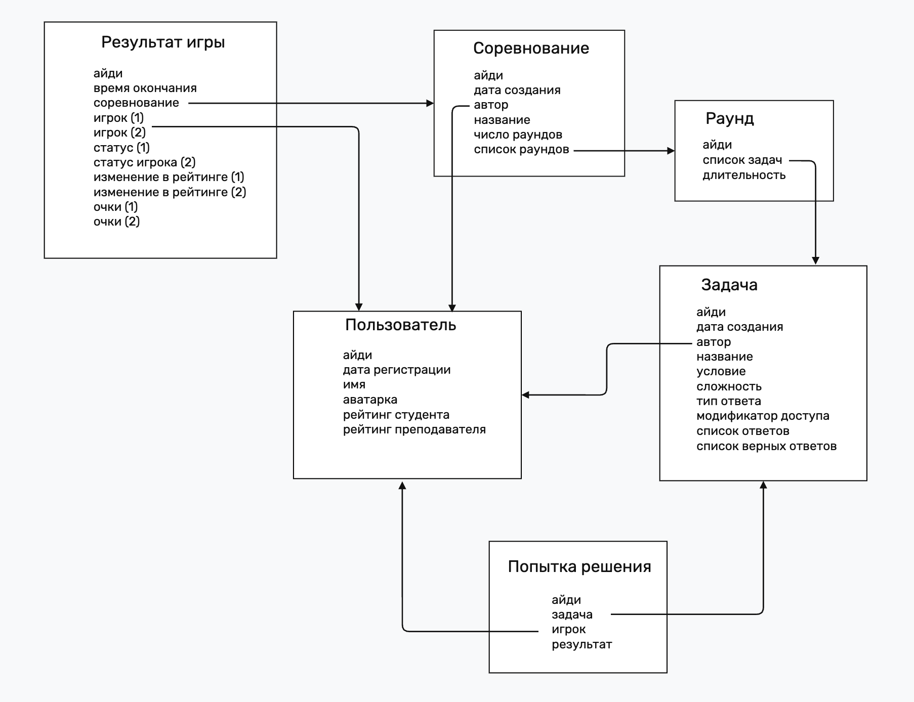

# Экономические бои

[https://econ-battle.ru](https://econ-battle.ru)

----

### Это приложение для преподавателей и студентов для решения задач по разным экономическим моделям в игровом формате.

----

Команда для запуска приложения
```shell
docker compose up
```

## Содержание

...

## Подробное описание

...

## Сущности и их взаимодействие



## Используемые технологии

Бэкенд:
- Python 3.11.5: FastAPI, SQLAlchemy, websockets, Authlib, redis, pydantic
- SQL: PostgresSQL 17

Фронтенд:
- ReactJS + Vite

Контейнеризация:
- Docker, docker compose

Веб-сервер:
- nginx

## Обзор структуры

Проект состоит из 5 контейнеров: фронтенд, бэкенд, постгрес, редис и нгинкс

У каждого своя папка и свой докерфайлик.

### Бэкенд

Использую классическую слоистую архитектуру, то есть делю приложение на три изолированных друг от друга слоя:
- Слой представления

В него входят все API-эндпоинты. Они получают от пользователя параметры, проверяют их на валидность 
и обращаются к слою бизнес логики для получения или обработки данных по заранее известной pydantic схеме.

Туда также вошел эндпоинт для подключения игрока по вебсокету к серверу. 

Код лежит в папке [backend/src/api/](backend/src/api/v1/)

- Слой бизнес-логики

Этот слой имеет доступ к интерфейсам для работы с базой данных, написанными в свое работы с ней. 
Он их агрегирует данные, собирает их для последующей отдачи на слой представления.
Общение между всеми тремя слоями строится на строгих типизированных схемах, что повышает надежность системы.

Код лежит в папке [backend/src/service/](backend/src/service/)

- Слой работы с базой данных

В нем реализовано подключение к базе данных и разные функции для выполнения sql-запросов через ORM, что позволяет иметь
унифицированный интерфейс и защищаться от SQL-инъекций. Запрос к разным таблицам лежат в разных классах. Реализована транзакционность в работе с базой данных.

Код лежит в папке [backend/src/repository/](backend/src/repository/)

### Фронтенд

Поделил код на компоненты и страницы: компоненты являются частью страниц и переиспользуются на них.
Каждый компонент и страница находится в своей папке и является парой JSX файл + CSS стили.

Отдельно отмечу, что аутентификация пронизывает все приложение и без нее пользователь не сможет получить доступ к любой странице.

### База данных PostgresSQL

Запрос для создания базы данных:

```postgresql
-- Создание таблицы users
CREATE TABLE users (
    id TEXT PRIMARY KEY,
    created_at TIMESTAMP WITH TIME ZONE DEFAULT CURRENT_TIMESTAMP,
    username TEXT NOT NULL,
    picture TEXT NOT NULL DEFAULT '/static/default-avatar.jpg',
    student_rating INTEGER NOT NULL DEFAULT 1000,
    teacher_rating INTEGER NOT NULL DEFAULT 1000
);

-- Создание таблицы tasks
CREATE TABLE tasks (
    id SERIAL PRIMARY KEY,
    created_at TIMESTAMP WITH TIME ZONE DEFAULT CURRENT_TIMESTAMP,
    creator_id TEXT NOT NULL REFERENCES users(id),
    name VARCHAR NOT NULL,
    text VARCHAR NOT NULL,
    price INTEGER NOT NULL,
    task_type VARCHAR NOT NULL,
    value JSON NOT NULL,
    correct_value JSON NOT NULL,
    access_type VARCHAR NOT NULL DEFAULT 'public'
);

-- Создание таблицы competitions
CREATE TABLE competitions (
    id SERIAL PRIMARY KEY,
    created_at TIMESTAMP WITH TIME ZONE DEFAULT CURRENT_TIMESTAMP,
    name VARCHAR NOT NULL,
    creator_id TEXT NOT NULL REFERENCES users(id),
    max_rounds INTEGER NOT NULL,
    tasks_markup JSON NOT NULL
);

-- Создание таблицы rounds
CREATE TABLE rounds (
    id SERIAL PRIMARY KEY,
    created_at TIMESTAMP WITH TIME ZONE DEFAULT CURRENT_TIMESTAMP,
    player_1 TEXT NOT NULL,
    player_2 TEXT NOT NULL,
    points_player_1 INTEGER NOT NULL,
    points_player_2 INTEGER NOT NULL,
    status_player_1 VARCHAR NOT NULL,
    status_player_2 VARCHAR NOT NULL
);

-- Создание таблицы games
CREATE TABLE games (
    id SERIAL PRIMARY KEY,
    created_at TIMESTAMP WITH TIME ZONE DEFAULT CURRENT_TIMESTAMP,
    competition_id INTEGER NOT NULL REFERENCES competitions(id),
    player_1 TEXT NOT NULL REFERENCES users(id),
    player_2 TEXT NOT NULL REFERENCES users(id),
    rounds INTEGER[] NOT NULL DEFAULT ARRAY[]::INTEGER[],
    status_player_1 VARCHAR NOT NULL,
    status_player_2 VARCHAR NOT NULL,
    rating_difference_player_1 INTEGER NOT NULL,
    rating_difference_player_2 INTEGER NOT NULL,
    score_player_1 INTEGER NOT NULL,
    score_player_2 INTEGER NOT NULL
);

-- Создание таблицы tasks_stats
CREATE TABLE tasks_stats (
    id SERIAL PRIMARY KEY,
    created_at TIMESTAMP WITH TIME ZONE DEFAULT CURRENT_TIMESTAMP,
    task_id INTEGER NOT NULL REFERENCES tasks(id),
    user_id TEXT NOT NULL REFERENCES users(id),
    result TEXT NOT NULL
);
```

## Контакты

почта: oashvetsov@edu.hse.ru

телеграм: olezha223
